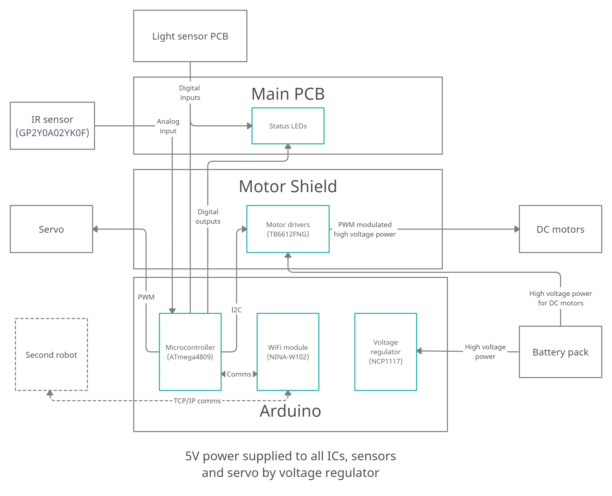

# Team Optimal Electrical Design

This repository contains schematics and PCB layouts for the electronics of the
Team Optimal IDP Robots.

Note that I haven't set up the library locations properly (because I'd rather
sleep). Just replace all occurences of `/home/el/idp/electrical` with the
location of this repository and you should be fine.

# System diagram

