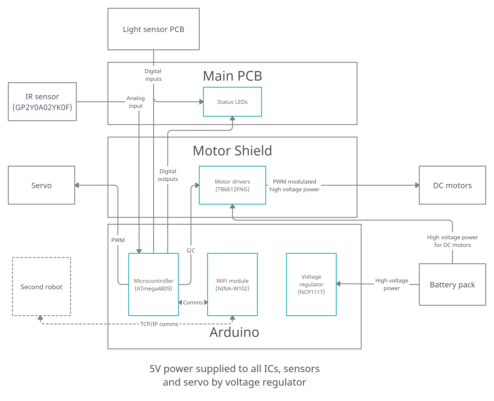

# Team Optimal Electrical Design

This repository contains schematics and PCB layouts for the electronics of the
Team Optimal IDP robots. We operate with two PCBs: the Main PCB and the Color
Sensors PCB.

Note that Eleanor hasn't set up the library locations properly (because he'd rather
sleep). Just replace all occurences of `/home/el/idp/electrical` with the
location of this repository and you should be fine.

## System diagram

